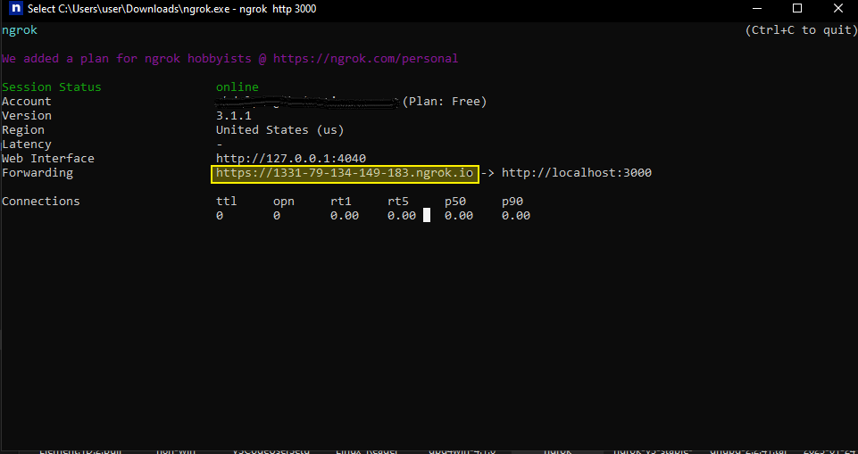

<Warning>
This setup is only meant for personal use or testing. It runs on SQLite3 and an in-memory Redis queue, which supports only a single instance on a single machine. For production or multi-instance setups, you must use Docker Compose with PostgreSQL and Redis.
</Warning>

To get up and running quickly with IOPeer, we will use the IOPeer Docker image. Follow these steps:

## Prerequisites

You need to have [Git](https://git-scm.com/book/en/v2/Getting-Started-Installing-Git) and [Docker](https://docs.docker.com/get-docker/) installed on your machine in order to set up IOPeer via Docker Compose.

## Install

### Pull Image and Run Docker image 

Pull the IOPeer Docker image and run the container with the following command:

```bash
docker run -d -p 8080:80 -v ~/.iopeer:/root/.iopeer -e AP_REDIS_TYPE=MEMORY -e AP_DB_TYPE=SQLITE3 -e AP_FRONTEND_URL="http://localhost:8080" iopeer/iopeer:latest
```

### Configure Webhook URL (Important for Triggers, Optional If you have public IP)

**Note:** By default, IOPeer will try to use your public IP for webhooks. If you are self-hosting on a personal machine, you must configure the frontend URL so that the webhook is accessible from the internet.

**Optional:** The easiest way to expose your webhook URL on localhost is by using a service like ngrok. However, it is not suitable for production use.

1. Install ngrok
2. Run the following command:
```bash
ngrok http 8080
```
3. Replace `AP_FRONTEND_URL` environment variable in the command line above.




## Upgrade 

Please follow the steps below:

### Step 1: Back Up Your Data (Recommended)

Before proceeding with the upgrade, it is always a good practice to back up your IOPeer data to avoid any potential data loss during the update process.

1. **Stop the Current IOPeer Container:** If your IOPeer container is running, stop it using the following command:
   ```bash
   docker stop iopeer_container_name
   ```

2. **Backup IOPeer Data Directory:** By default, IOPeer data is stored in the `~/.iopeer` directory on your host machine. Create a backup of this directory to a safe location using the following command:
   ```bash
   cp -r ~/.iopeer ~/.iopeer_backup
   ```

### Step 2: Update the Docker Image

1. **Pull the Latest IOPeer Docker Image:** Run the following command to pull the latest IOPeer Docker image from Docker Hub:
   ```bash
   docker pull iopeer/iopeer:latest
   ```

### Step 3: Remove the Existing IOPeer Container

1. **Stop and Remove the Current IOPeer Container:** If your IOPeer container is running, stop and remove it using the following commands:
   ```bash
   docker stop iopeer_container_name
   docker rm iopeer_container_name
   ```

### Step 4: Run the Updated IOPeer Container

Now, run the updated IOPeer container with the latest image using the same command you used during the initial setup. Be sure to replace `iopeer_container_name` with the desired name for your new container.

```bash
docker run -d -p 8080:80 -v ~/.iopeer:/root/.iopeer -e AP_REDIS_TYPE=MEMORY -e AP_DB_TYPE=SQLITE3 -e AP_FRONTEND_URL="http://localhost:8080" --name iopeer_container_name iopeer/iopeer:latest
```


Congratulations! You have successfully upgraded your IOPeer Docker deployment
