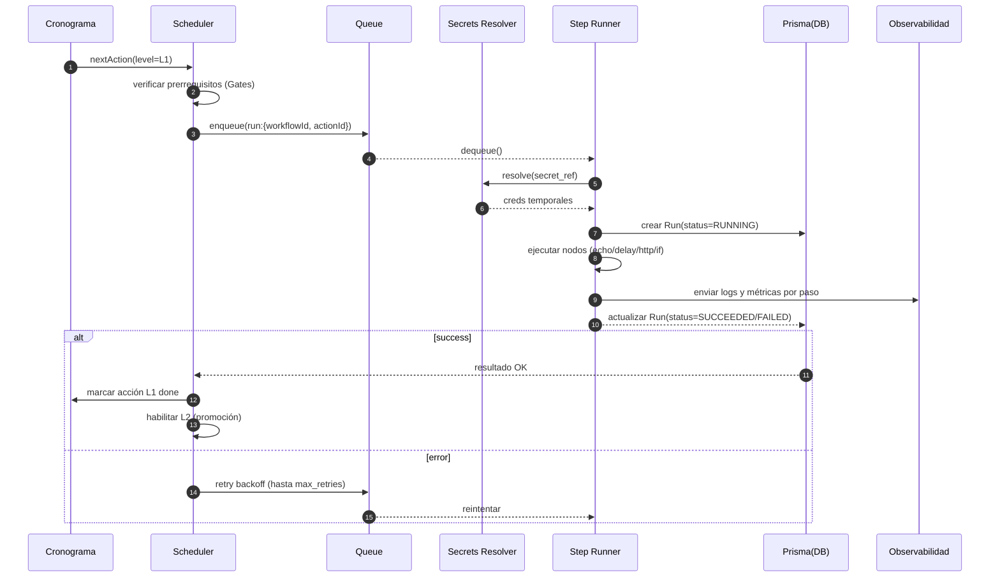

# 📘 IOpeer Workflow Flow Documentation

## 🧭 Visión general
Los **workflows de IOpeer** siguen una estructura ascendente y segura. Cada nivel (L1–L5) representa un grado mayor de complejidad y madurez del sistema. El **Scheduler** se encarga de ejecutar las acciones en orden ascendente, garantizando que las dependencias se cumplan antes de avanzar.

---

## 🧩 Diagrama de flujo general

```mermaid
flowchart TD
  subgraph Inputs
    A[Backlog Técnico] -->|prioridad/complexidad| B[Cronograma Ascendente]
    C[Eventos (Webhooks/Manuales)] --> B
  end

  subgraph Planificación
    B --> D[Scheduler (Cron/Interval)]
    D --> E[Selector de Próxima Acción (L1→L5)]
    E --> F{Gates de Seguridad<br/>y Prerrequisitos}
    F -->|OK| G[Enqueue Run (Queue in-memory)]
    F -->|Falla| F1[Reprogramar/Registrar bloqueo]
  end

  subgraph Ejecución
    G --> H[Resolver Secrets (secret_ref→env/KV)]
    H --> I[Sandbox de Ejecución<br/>(Step Runner)]
    I --> J[Logs por Paso + Métricas]
    I --> K{Resultado}
    K -->|Success| L[Persistir Run: SUCCEEDED]
    K -->|Error| M[Retry con Backoff]
    M -->|Max Retries| N[Persistir Run: FAILED]
    M -->|Aún hay retries| G
  end

  subgraph Promoción y Despliegue
    L --> O{Gate de Calidad/SLO<br/>Tests e2e, p95/p99, error_rate}
    O -->|OK x 60min| P[Promote canary→prod]
    O -->|No OK| Q[Hold + Alertas Slack]
    P --> R[Deploy estable]
  end

  subgraph Observabilidad
    J --> S[Logs estructurados (Pino)]
    J --> T[Métricas (/metrics)]
    L --> U[Alertas éxito (Slack)]
    N --> V[Alertas fallo (Slack + email)]
  end
```

---

## 🔁 Secuencia de ejecución (una acción ascendente)



---

## 📈 Cronograma ascendente — Niveles

| Nivel | Descripción | Ejemplo de tareas |
|-------|--------------|-------------------|
| L1 | Fundacional | Health API, configuración base, hook Supabase Auth |
| L2 | Persistencia | Prisma modelos `Connection`, `Run`, migraciones |
| L3 | Ejecución | Cola in-memory, `RunsController`, nodos básicos |
| L4 | Calidad y observabilidad | Tests, logs, métricas p95/p99 |
| L5 | Entrega | Deploy canary → prod, rollback automático |

---

## 🧠 Ejemplo DSL del plan (JSON)

```json
{
  "plan": "iopeer-bootstrap",
  "policy": {
    "order": "ascending",
    "retry": { "max": 3, "strategy": "exponential", "baseMs": 2000 },
    "gates": {
      "L2_requires": ["L1"],
      "L3_requires": ["L2"],
      "L4_requires": ["L3"],
      "L5_requires": ["L4"]
    },
    "promote": { "windowMinutes": 60, "slo": { "errorRatePct": 1, "p95Ms": 600 } }
  },
  "schedule": [
    {
      "id": "L1-HEALTH",
      "level": "L1",
      "workflowId": "wf.health",
      "pre": ["env:API_PORT", "db:reachable"],
      "nodes": [
        { "id": "n1", "type": "echo", "params": { "message": "Boot L1" } },
        { "id": "n2", "type": "http", "params": { "url": "http://api:3001/health" } }
      ]
    },
    {
      "id": "L2-PRISMA",
      "level": "L2",
      "workflowId": "wf.prisma.migrate",
      "pre": ["L1-HEALTH:SUCCEEDED"],
      "nodes": [
        { "id": "n1", "type": "echo", "params": { "message": "Migrating DB" } },
        { "id": "n2", "type": "shell", "params": { "cmd": "pnpm -C apps/api prisma migrate deploy" } }
      ]
    },
    {
      "id": "L3-RUNNER",
      "level": "L3",
      "workflowId": "wf.runner.basic",
      "pre": ["L2-PRISMA:SUCCEEDED"],
      "nodes": [
        { "id": "n1", "type": "delay", "params": { "ms": 500 } },
        { "id": "n2", "type": "echo", "params": { "message": "Queue up" } },
        { "id": "n3", "type": "http", "params": { "url": "http://api:3001/runs/test" } }
      ]
    },
    {
      "id": "L4-QUALITY",
      "level": "L4",
      "workflowId": "wf.quality",
      "pre": ["L3-RUNNER:SUCCEEDED"],
      "nodes": [
        { "id": "n1", "type": "shell", "params": { "cmd": "pnpm -C apps/api test" } },
        { "id": "n2", "type": "metrics.assert", "params": { "p95MsMax": 600, "errorRatePctMax": 1 } }
      ]
    },
    {
      "id": "L5-DELIVERY",
      "level": "L5",
      "workflowId": "wf.delivery",
      "pre": ["L4-QUALITY:SUCCEEDED"],
      "nodes": [
        { "id": "n1", "type": "http", "params": { "url": "http://ci/canary/deploy", "method": "POST" } },
        { "id": "n2", "type": "delay", "params": { "ms": 3600000 } },
        { "id": "n3", "type": "slo.check", "params": { "windowMin": 60, "p95MsMax": 600, "errorRatePctMax": 1 } },
        { "id": "n4", "type": "http", "params": { "url": "http://ci/promote", "method": "POST" } }
      ],
      "onFail": [
        { "type": "http", "params": { "url": "http://ci/rollback", "method": "POST" } },
        { "type": "slack.notify", "params": { "channel": "#iopeer-alerts", "message": "Rollback executed" } }
      ]
    }
  ]
}
```

---

## 🧠 Componentes técnicos involucrados

- **SchedulerService** → lee el plan, valida dependencias y gates, y encola ejecuciones.
- **RunsService** → maneja cola en memoria, ejecución de pasos y persistencia de resultados.
- **GateService** → controla prerequisitos (env, DB, dependencias previas) y gates de calidad.
- **StepRunner** → ejecuta nodos del DSL (echo, delay, http, shell, slack.notify, etc.).
- **Connectors** → interfaz genérica para nuevos pasos o integraciones.
- **ObservabilityService** → maneja logs estructurados, métricas y alertas.

---

## ✅ Propósito final
Garantizar un flujo **ascendente, seguro y verificable**, donde IOpeer construya y despliegue sus propios componentes de manera autónoma, respetando gates de calidad y dependencias previas, hasta alcanzar una ejecución continua y estable.

